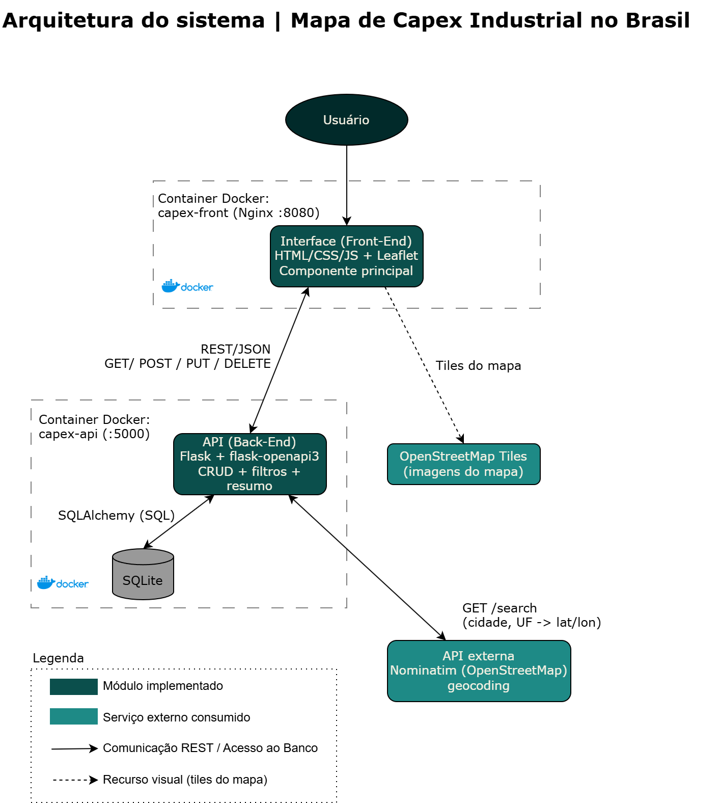

# Mapa de Capex Industrial no Brasil (Interface)

MVP da Sprint 02 (Arquitetura de Software) da pós-graduação em Engenharia de Software.

A aplicação reúne projetos de investimento industrial (capex) em andamento no Brasil e os mostra num mapa interativo. O objetivo é dar uma visão rápida de onde a indústria está investindo: quais empresas, setores, estados e em que fase cada projeto está.

Este repositório contém a **interface (componente principal)**. A API está em outro repositório: https://github.com/dev-guilhermemoraes/capex-map-api

## Funcionalidades

- Mapa interativo (Leaflet) com um círculo por projeto: o tamanho é proporcional ao investimento e a cor indica o status.
- Painel com total de projetos, investimento mapeado e número de estados.
- Filtros por estado e por status.
- Cadastro, edição e remoção de projetos por formulário.
- Localização automática: ao informar cidade e UF, a API busca as coordenadas no serviço externo.

## Arquitetura

A solução segue o **Cenário 1.1**: a interface se comunica via REST com a API (back-end), que persiste os dados em SQLite e consulta a API externa Nominatim.



### Chamadas feitas pela interface à API

| Método | Rota | Quando é chamada |
|---|---|---|
| GET | `/projetos` | Ao abrir a página e ao mudar os filtros |
| GET | `/resumo` | Ao abrir a página e após cada alteração (atualiza o painel) |
| POST | `/projetos` | Ao salvar um novo projeto (a API chama o Nominatim) |
| PUT | `/projetos/{id}` | Ao salvar a edição de um projeto |
| DELETE | `/projetos/{id}` | Ao remover um projeto pelo popup do mapa |

## API externa: Nominatim (OpenStreetMap)

- **O que é:** serviço público e gratuito de geocoding do OpenStreetMap. Converte endereço (cidade/UF) em latitude e longitude.
- **Onde é usada:** consumida pela API back-end ao cadastrar ou editar um projeto sem coordenadas. O resultado é tratado e salvo no banco; o usuário não é redirecionado para nenhum serviço externo.
- **Licença:** dados © colaboradores do OpenStreetMap, sob a Open Database License (ODbL). Uso sujeito à política de uso da Nominatim (https://operations.osmfoundation.org/policies/nominatim/).
- **Cadastro:** não exige cadastro nem chave de API.
- **Rota utilizada:** `GET https://nominatim.openstreetmap.org/search?city={cidade}&state={uf}&country=Brasil&format=json&limit=1`
- **Cuidados adotados:** no máximo 1 requisição por segundo e `User-Agent` identificando a aplicação. Se a cidade não for encontrada ou o serviço estiver indisponível, a API retorna 422 com uma mensagem explicativa.

Os tiles do mapa também vêm do OpenStreetMap (https://tile.openstreetmap.org), com atribuição exibida no mapa.

## Como executar

### Aplicação completa com Docker Compose (recomendado)

Pré-requisitos: Docker e Docker Compose instalados.

1. Clone os dois repositórios na mesma pasta:

   ```bash
   git clone https://github.com/dev-guilhermemoraes/capex-map-front.git
   git clone https://github.com/dev-guilhermemoraes/capex-map-api
   ```

2. Suba tudo a partir deste repositório:

   ```bash
   cd capex-map-front
   docker compose up --build
   ```

3. Acesse:
   - Interface: http://localhost:8080
   - API (Swagger): http://localhost:5000/openapi/swagger

### Apenas a interface com Docker

Com a API já rodando na porta 5000:

```bash
docker build -t capex-front .
docker run -p 8080:80 capex-front
```

### Sem Docker

Abra o `index.html` no navegador ou sirva a pasta:

```bash
python -m http.server 8080
```

O endereço da API fica em `config.js` (padrão: `http://localhost:5000`).

## Estrutura

```
capex-map-front/
├── index.html           # estrutura da página
├── styles.css           # estilos
├── scripts.js           # mapa, lista, filtros e chamadas à API
├── config.js            # endereço da API
├── docs/arquitetura.png # fluxograma da arquitetura
├── Dockerfile
└── docker-compose.yml
```
